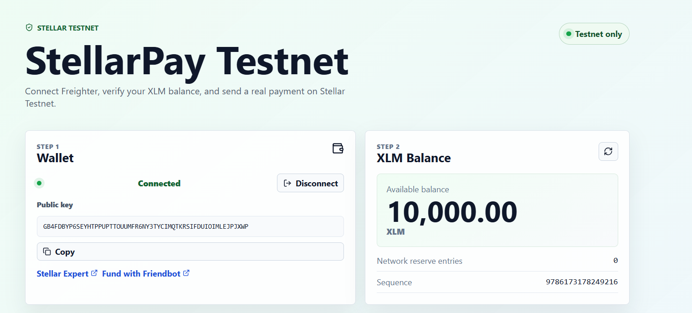
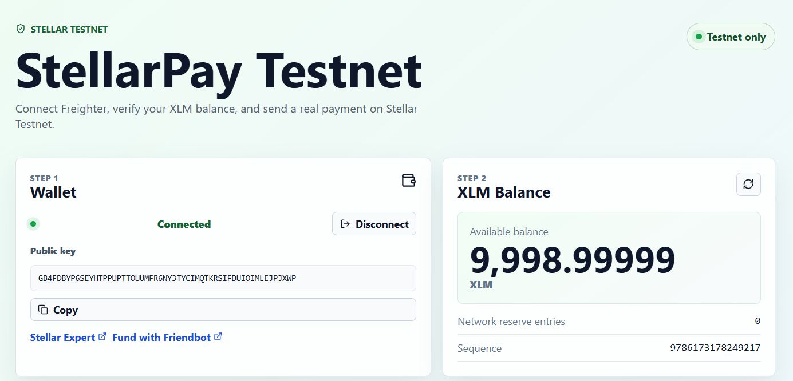
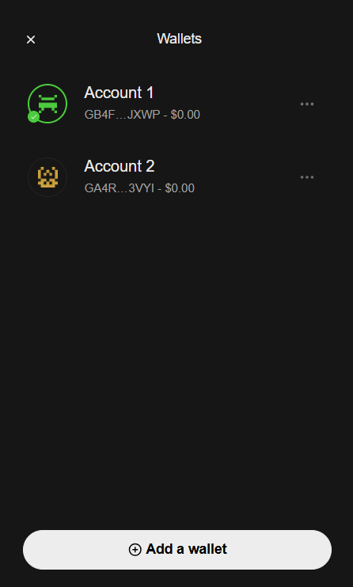
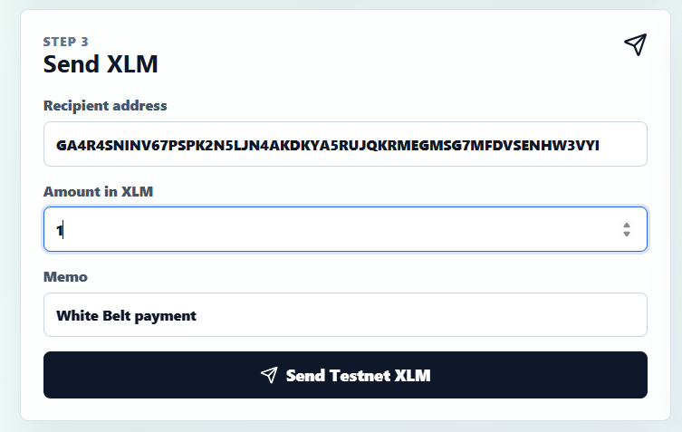
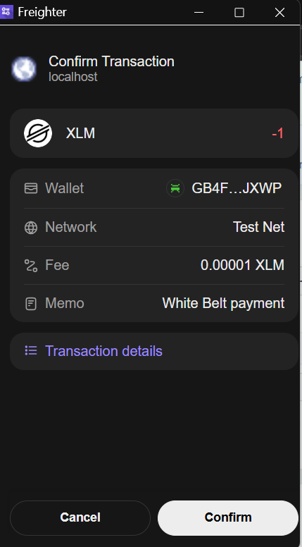
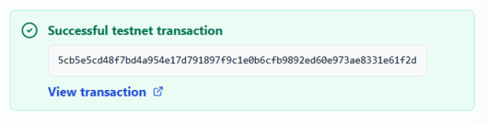
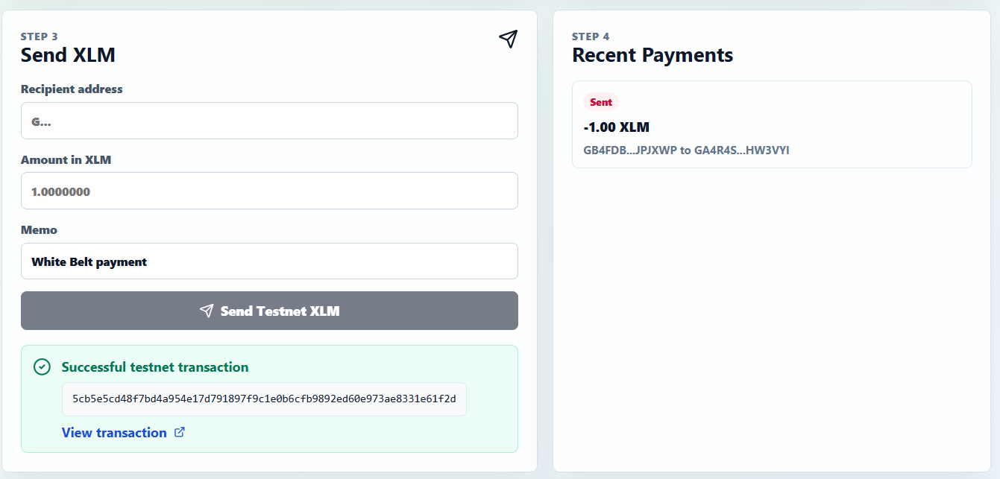

# StellarPay Testnet

StellarPay Testnet is a Level 1 White Belt submission project for the Stellar Journey builder challenge. It is a simple payment dApp that connects Freighter, reads the connected wallet's XLM balance from Stellar Testnet, sends XLM on Testnet, and shows clear transaction feedback with a hash and explorer link.

Repository: https://github.com/higgn/stellar-level-1-payment-dapp.git

## Features

- Freighter wallet connection and local disconnect flow
- Stellar Testnet only, using Horizon Testnet and the Testnet network passphrase
- Connected wallet address display, copy button, Stellar Expert account link, and Friendbot funding link
- XLM balance fetch with refresh button
- XLM payment form with recipient, amount, and memo inputs
- Transaction signing through Freighter, submission to Stellar Testnet, success or failure feedback, and transaction hash display
- Recent payment history with Stellar Expert transaction links

## Tech Stack

- Vite
- React
- TypeScript
- Stellar JavaScript SDK
- Freighter API
- Lucide React icons

## Run Locally

Requirements:

- Node.js 18 or newer
- Freighter browser extension
- A Freighter account switched to Stellar Testnet

```bash
git clone https://github.com/higgn/stellar-level-1-payment-dapp.git
cd stellar-level-1-payment-dapp
npm install
npm run dev
```

Open the local URL printed by Vite, usually `http://localhost:5173`.

## Deploy

The app is a static Vite site and can be deployed on Vercel, Netlify, Cloudflare Pages, or GitHub Pages.

Recommended Vercel settings:

- Framework preset: Vite
- Build command: `npm run build`
- Output directory: `dist`

After deployment, add the live URL here:

```text
Live demo: <your-deployed-url>
```

## Testnet Usage

1. Install Freighter from https://freighter.app/.
2. In Freighter, switch the network to Testnet.
3. Connect the wallet in the app.
4. Click `Fund with Friendbot` if the account has no Testnet XLM.
5. Refresh the balance in the app.
6. Send XLM to another funded Stellar Testnet address.
7. Confirm the transaction in Freighter.
8. Verify the success message, transaction hash, and Stellar Expert link.

## Local Testing Checklist

Use Chrome, Brave, or Edge with the Freighter extension installed. The VS Code built-in browser usually cannot access browser extensions, so it may show `Wallet connection failed` even when the app code is correct.

1. Start the app:

```bash
npm run dev
```

2. Open the Vite URL in your normal browser, usually `http://localhost:5173`.
3. Open Freighter and create or import a test wallet.
4. Switch Freighter to `Testnet`.
5. Click `Connect Freighter` in the app and approve the request.
6. If the balance is empty, click `Fund with Friendbot`, wait a few seconds, then click the balance refresh button.
7. For a real payment test, create or use a second funded Testnet address as the recipient.
8. Enter a small amount such as `1` XLM and submit.
9. Approve the transaction in Freighter.
10. Confirm that the app shows `Transaction confirmed`, a transaction hash, and a Stellar Expert link.

Take the required submission screenshots after steps 5, 6, and 10.

## Screenshots

### Wallet connected

Freighter connected on Stellar Testnet with the public key visible.



### Balance displayed

The connected wallet's XLM balance is fetched from Stellar Testnet and shown in the app.



### Two funded test accounts

Two Testnet accounts are available for the payment flow.



### Payment form filled

Recipient, amount, and memo are filled before submitting the Testnet payment.



### Freighter transaction confirmation

Freighter shows the Testnet transaction confirmation before signing.



### Transaction result

The app shows the successful transaction result with the transaction hash.



### Recent payments

The recent payments panel shows the submitted Testnet payment history.



## Requirement Coverage

| Requirement | Status | Where |
| --- | --- | --- |
| Set up Freighter wallet | Complete | Freighter API connection flow |
| Use Stellar Testnet | Complete | Horizon Testnet and `Networks.TESTNET` |
| Wallet connect | Complete | Connect Freighter button |
| Wallet disconnect | Complete | Disconnect button clears local session |
| Fetch XLM balance | Complete | Balance panel calls Horizon account data |
| Display balance clearly | Complete | XLM balance panel |
| Send XLM transaction | Complete | Send XLM form |
| Show success or failure | Complete | Notice banner and transaction result panel |
| Show transaction hash | Complete | Success panel with Stellar Expert link |
| Development standards | Complete | Typed service layer, validation, error handling, responsive UI |

## Notes

This app is for Stellar Testnet only. Do not use real funds or Mainnet accounts.
